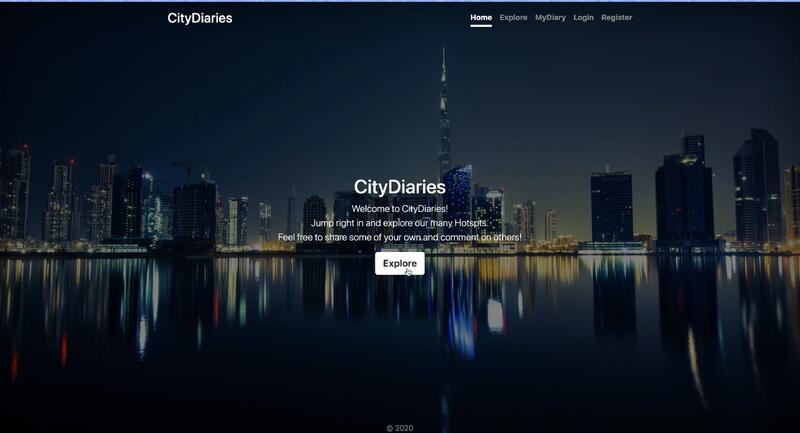
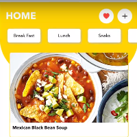
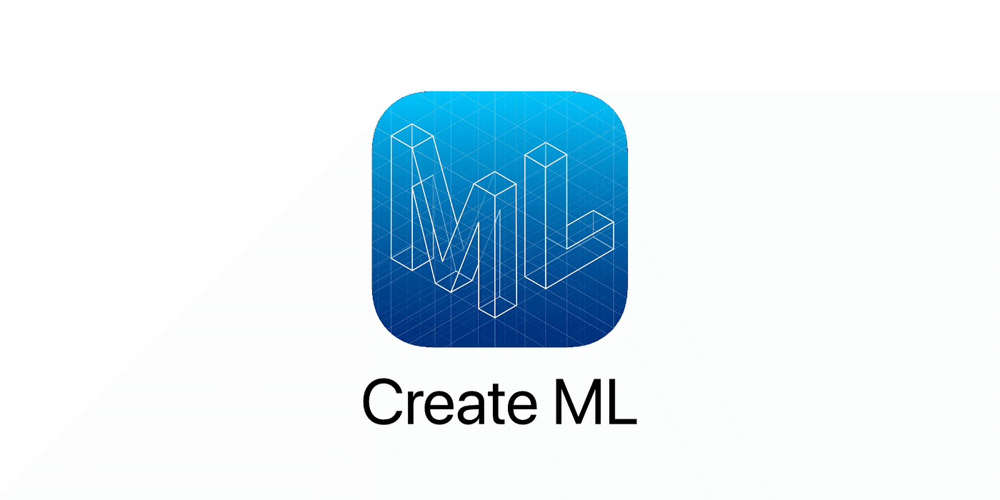
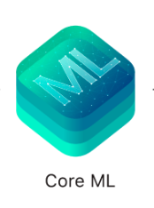

  <!-- the full-width banner -->
  
  <!-- your personal logo, floated right -->
  

# 👋 Hey, I'm Nithish Kadam  
🎓 MS in Computer Science @ Northeastern (GPA 4.0)  
💼 Software Engineer | Wintergreen Intern | Ex–Manhattan Associates  
☁️ AWS Certified Solutions Architect – Associate  
🔗  

## 🚀 Projects
<table>
  <tr>
    <td align="center" width="50%">
        
      <b>CityDiaries</b> 
      
        A travel diary app to share, discover, and comment on hotspots. 
        <b>Stack:</b> MongoDB · EJS · JavaScript · Express.js · AJAX · Node.js 
        🔗 <a href="https://github.com/NithishKadamGanesh/CityDiaries">GitHub Repo</a> |
        📽️ <a href="https://drive.google.com/file/d/1AKNWGgQdB1jVgxHdhj1Srup5VytUzIPE/view">Video Demo</a>
      
    </td>
    <td align="center" width="100px">
        
      <b>Fudget</b> 
      
        A recipe app that detects ingredients & recommends recipes  
        <b>Stack:</b> Swift · CreateML · REST APIs 
        🔗 <a href="https://github.com/NithishKadamGanesh/Fudget">GitHub Repo</a> |
        📽️ <a href="https://drive.google.com/file/d/1RtRBs0T4OZkdz-leR3FLga_iukto22Cb/view">Video Demo</a>
      
    </td>
  </tr>
</table>

## 💻 Programming Languages  

  
  
  
  
  
   <!-- SQL -->
  
  

## 🛠️ Frameworks & Libraries  

  
  
  
  
  
  
  
  

## 🗄️ Databases & Cloud  

  
  
  
  
  
  
  
  
  

## ⚙️ Tools & Technologies  

  
  
  
  
  
  
  
  
  
  
  
  

## 📜 Certifications   

  <a href="https://www.credly.com/badges/0fc14dba-6af4-4cba-8aee-074ec4a24aa1/public_url" target="_blank">
    <!-- your local PNG -->
    
    <!-- shields.io badge as an  -->
    
  </a>

## ✨ Fun Facts  
- ⚽ Die-hard Chelsea FC fan—there’s nothing like the roar at Stamford Bridge when “Blue is the Colour” hits!  
- 🏎️ Formula 1 fan, especially Max Verstappen’s precision on track.  
- 🏏 Loyal RCB supporter—through every IPL high and low, I back the Men in Red with unwavering passion.  
- 🥊 State amateur boxing bronze medalist—ring-tested and always up for a new challenge.
- 📖 Manga & Manhwa fan—always chasing the next epic chapter. 

## ☕ Let's Connect  

  
  &nbsp;
  
  &nbsp;
  

<!-- Bottom Banner -->

  

