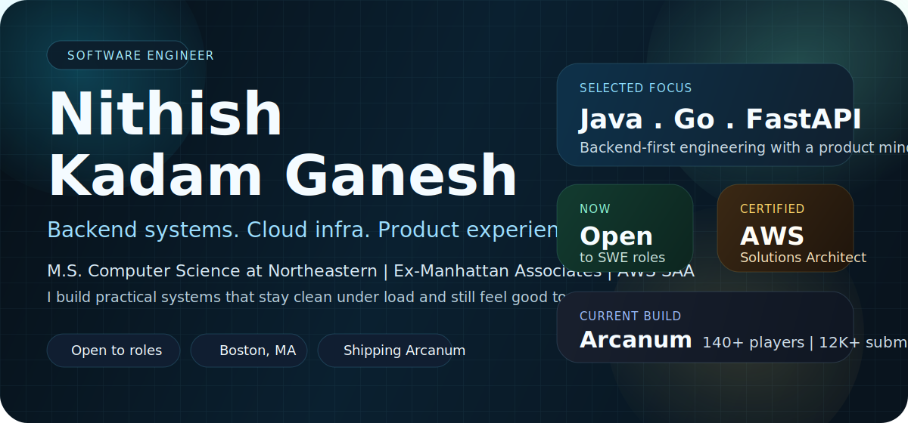
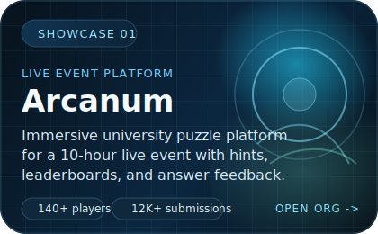
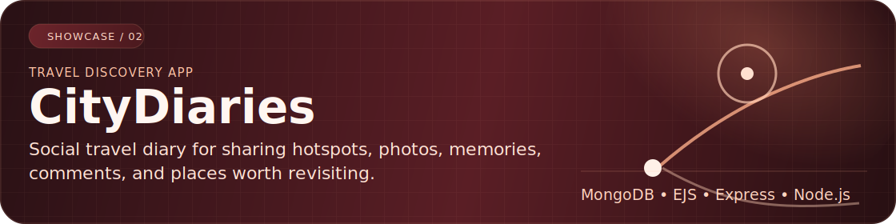
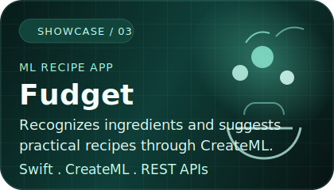

  

  <a href="https://www.nithishkadam.com/">portfolio</a>
  ·
  <a href="./Nithish_Resume.pdf">resume</a>
  ·
  <a href="https://www.linkedin.com/in/nithishkadam/">linkedin</a>
  ·
  <a href="mailto:nithishkadam@gmail.com">email</a>

  Backend engineer focused on APIs, cloud systems, and product experiences that feel clean and deliberate.

## About

I am an M.S. Computer Science student at Northeastern University and an ex-Manhattan Associates engineer focused on backend platforms, APIs, cloud systems, and product experiences that feel deliberate.

Recent work includes healthcare reporting systems at Wintergreen and Arcanum, a live university puzzle platform that handled 140+ registrations, 90+ concurrent users, and 12K+ submissions across a 10-hour event.

## Selected Work

  

<table>
  <tr>
    <td width="50%" valign="top">
      
    </td>
    <td width="50%" valign="top">
      
    </td>
  </tr>
</table>

  <strong>Arcanum</strong> - Live event platform with immersive gameplay, auth, hints, leaderboards, and answer-feedback systems.
  <a href="https://github.com/Arcanum-CTF">GitHub org</a>  
  <strong>CityDiaries</strong> - Full-stack travel diary app for sharing hotspots, memories, photos, and comments.
  <a href="https://github.com/NithishKadamGanesh/CityDiaries">Repo</a> ·
  <a href="https://drive.google.com/file/d/1AKNWGgQdB1jVgxHdhj1Srup5VytUzIPE/view">Demo</a>  
  <strong>Fudget</strong> - Mobile recipe assistant that recognizes ingredients and suggests meals using ML.
  <a href="https://github.com/NithishKadamGanesh/Fudget">Repo</a> ·
  <a href="https://drive.google.com/file/d/1RtRBs0T4OZkdz-leR3FLga_iukto22Cb/view">Demo</a>

## What I Work With

`Java` `Spring Boot` `Go` `FastAPI` `Node.js` `React` `PostgreSQL` `MongoDB` `Redis` `Kafka` `RabbitMQ` `AWS` `Docker` `Kubernetes` `Terraform`

## Experience

- `Wintergreen` - Built reporting infrastructure and APIs for healthcare workflows using Node.js, Express, JasperReports, React Native, PHP, and Laravel.
- `Manhattan Associates` - Worked on distributed transaction flows, messaging pipelines, and warehouse management enhancements for global clients.
- `Northeastern University` - Pursuing an M.S. in Computer Science with coursework in Algorithms, AI, Database Systems, NLP, and Scalable Distributed Systems.

## Beyond Work

Chelsea FC, Formula 1, RCB, boxing, manga, and manhwa.
